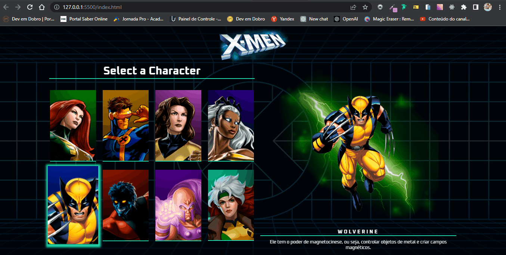

# Character Selection X-Men  

## Bem-Vindos! 👋

Este projeto tem como objetivo criar uma página interativa de seleção de personagens da grande franquia X-Men. A página permite aos usuários explorar uma galeria de personagens e interagir com eles ao passar o mouse sobre cada um.

## Funcionalidades

Troca de Personagens: Ao passar o mouse sobre um personagem, a imagem do mesmo é substituída por outra, assim como o nome e a descrição desse personagem, destacando a interatividade da página.

## Tecnologias utilizadas

- HTML5
- CSS3
- JAVASCRIPT

Manipulação do DOM: O JavaScript é utilizado para manipular o Document Object Model (DOM) e realizar alterações na página em tempo real.

Event Listeners: Foram adicionados event listeners aos elementos dos personagens, de forma a detectar quando o mouse passa sobre eles.

Troca de Imagens: Ao acionar o evento de passagem do mouse sobre um personagem, o código JavaScript realiza a substituição da imagem do personagem por outra, criando a ilusão de troca de personagens.

## Instruções para execução

1. Clone o repositório para o seu computador.
2. Abra o arquivo `index.html` em um navegador web para visualizar a página.

## Contribuição

Contribuições são bem-vindas! Se você tiver alguma sugestão, correção de bugs ou melhorias para este projeto, sinta-se à vontade para abrir uma issue ou enviar um pull request.

Esperamos que essa página de seleção de personagens X-Men traga uma experiência interativa e divertida para os fãs da franquia. Aproveite e explore o mundo dos mutantes com essa página incrível!

# Veja o Projeto Online
Deploy Do Projeto

- [GitHub Pages](https://vandesonsantos.github.io/character-selectionX-Men/)